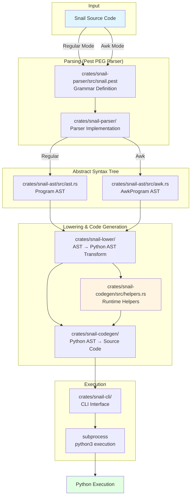

<p align="center">
  
</p>

<h1 align="center">Snail</h1>
<p align="center"><em>What do you get when you shove a snake in a shell?</em></p>

<h1>Snail, while I hope it is useful to myself and others, is my attempt at
improving my knowledge of AI code developement. Things are probably broken
in interesting and horrible ways.</h1>

---

**Snail** is a programming language that compiles to Python, combining Python's power with Perl/awk-inspired syntax for quick scripts and one-liners. No more whitespace sensitivity—just curly braces and concise expressions.

## ✨ What Makes Snail Unique

### Curly Braces, Not Indentation

Write Python logic without worrying about tabs vs spaces:

```snail
def process(items) {
    for item in items {
        if item > 0 { print(item) }
        else { continue }
    }
}
```

### Built-in Subprocess Pipelines

Shell commands are first-class citizens with `$()` capture and `|` piping:

```snail
# Capture command output with interpolation
name = "world"
greeting = $(echo hello {name})

# Pipe data through commands
result = "foo\nbar\nbaz" | $(grep bar) | $(cat -n)

# Check command status
@(make build)?  # returns exit code on failure instead of raising
```

### Compact Error Handling

The `?` operator makes error handling terse yet expressive:

```snail
# Swallow exception, get the error object
err = risky_operation()?

# Provide a fallback value (exception available as $e)
value = parse_json(data):{}?
details = fetch_url(url):"Error: {$e}"?

# Access attributes directly
name = risky()?.__class__.__name__
args = risky()?.args[0]
```

### Regex Literals

Pattern matching without `import re`:

```snail
if email in /^[\w.]+@[\w.]+$/ {
    print("Valid email")
}

# Compiled regex for reuse
pattern = /\d{3}-\d{4}/
match = pattern.search(phone)
```

### Awk Mode

Process files line-by-line with familiar awk semantics:

```snail
#!/usr/bin/env -S snail --awk -f
BEGIN { total = 0 }
/^[0-9]+/ { total = total + int($f[0]) }
END { print("Sum:", total) }
```

Built-in variables: `$l` (line), `$f` (fields), `$n` (line number), `$fn` (per-file line number), `$p` (file path), `$m` (last match).

### Pipeline Operator

The `|` operator enables data pipelining through objects that implement `__pipeline__`:

```snail
# Pipe data to subprocess stdin
result = "hello\nworld" | $(grep hello)

# Chain multiple transformations
output = "foo\nbar" | $(grep foo) | $(wc -l)

# Custom pipeline handlers
class Doubler {
    def __pipeline__(self, x) { return x * 2 }
}
doubled = 21 | Doubler()  # yields 42
```

### JSON Queries with JMESPath

Parse and query JSON data with the `json()` function and structured pipeline accessor:

```snail
# Parse JSON and query with $[jmespath]
data = json($(curl -s api.example.com/users))
names = data | $[users[*].name]
first_email = data | $[users[0].email]

# Inline parsing and querying
result = json('{"foo": 12}') | $[foo]
```

### Full Python Interoperability

Snail compiles to Python AST—import any Python module, use any library:

```snail
import pandas as pd
from pathlib import Path

df = pd.read_csv(Path("data.csv"))
filtered = df[df["value"] > 100]
```

## 🚀 Quick Start

```bash
# Run a one-liner
snail "print('Hello, Snail!')"

# Execute a script
snail -f script.snail

# Awk mode for text processing
cat data.txt | snail --awk '/error/ { print($l) }'

# See the generated Python
snail --python "x = risky()? ; print(x)"

# Self-update to latest release
snail --update
```

## 🏗️ Architecture

Snail compiles to Python through a multi-stage pipeline:



**Key Components:**

- **Parser**: Uses [Pest](https://pest.rs/) parser generator with PEG grammar defined in `src/snail.pest`
- **AST**: Separate representations for regular Snail (`Program`) and awk mode (`AwkProgram`) with source spans for error reporting
- **Lowering**: Transforms Snail AST into Python AST, generating runtime helper functions for Snail-specific features:
  - `?` operator → `__snail_compact_try` helper
  - `$(cmd)` subprocess capture → `__snail_subprocess_capture`
  - `@(cmd)` subprocess status → `__snail_subprocess_status`
  - Regex literals → `__snail_regex_search` and `__snail_regex_compile`
- **Code Generation**: Converts Python AST to executable Python source code
- **CLI**: Handles execution via subprocess, automatically respecting virtual environments

## 📚 Documentation

- **[Language Reference](docs/REFERENCE.md)** — Complete syntax and semantics
- **[examples/all_syntax.snail](examples/all_syntax.snail)** — Every feature in one file
- **[examples/awk.snail](examples/awk.snail)** — Awk mode examples

## 🔌 Editor Support

Vim/Neovim plugin with syntax highlighting, formatting, and run commands:

```vim
Plug 'sudonym1/snail', { 'rtp': 'extras/vim' }
```

See [extras/vim/README.md](extras/vim/README.md) for details. Tree-sitter grammar available in `extras/tree-sitter-snail/`.

## 🛠️ Building from Source

### Prerequisites

**Python 3.10+** (required at runtime)

Snail compiles to Python code and executes it via subprocess using whatever `python3` is in your PATH. This means:
- ✅ **Virtual environments are fully supported** - just activate your venv before running snail
- ✅ **No rebuild needed** when switching Python versions or environments
- ✅ **Configure Python interpreter** via `PYTHON` environment variable (e.g., `PYTHON=python3.12 snail ...`)

Installation per platform:
- **Ubuntu/Debian**: `sudo apt install python3 python3-dev`
- **Fedora/RHEL**: `sudo dnf install python3 python3-devel`
- **macOS**: `brew install python@3.12` (or use the system Python 3)
- **Windows**: Download from [python.org](https://www.python.org/downloads/)

**No Python packages required**: Snail vendors all necessary Python libraries (jmespath) directly into the generated code.

**Rust toolchain** (cargo and rustc)

Install Rust using [rustup](https://rustup.rs):

```bash
curl --proto '=https' --tlsv1.2 -sSf https://sh.rustup.rs | sh
```

This installs `cargo` (Rust's package manager) and `rustc` (the Rust compiler). After installation, restart your shell or run:

```bash
source $HOME/.cargo/env
```

Verify installation:

```bash
cargo --version  # Should show cargo 1.70+
rustc --version  # Should show rustc 1.70+
python3 --version  # Should show Python 3.10+
```

### Build and Install

```bash
# Clone the repository
git clone https://github.com/sudonym1/snail.git
cd snail

# Build the release binary
cargo build --release

# Install to ~/.local/bin (make sure it's in your PATH)
cp target/release/snail ~/.local/bin/

# Or use the Makefile (runs tests, builds, and installs)
make install
```

Add `~/.local/bin` to your PATH if it's not already there:

```bash
echo 'export PATH="$HOME/.local/bin:$PATH"' >> ~/.bashrc
source ~/.bashrc
```

### Running Tests

```bash
# Run all tests (parser, lowering, awk mode, CLI; excludes proptests by default)
cargo test

# Run tests including property-based tests (proptests)
cargo test --features run-proptests

# Run specific test suites
cargo test parser
cargo test awk
cargo test cli

# Check code formatting and linting
cargo fmt --check
cargo clippy -- -D warnings

# Build with all features enabled (required before committing)
cargo build --features run-proptests
```

**Note on Proptests**: The `snail-proptest` crate contains property-based tests that are skipped by default to keep development iteration fast. Use `--features run-proptests` to run them. Before committing, verify that `cargo build --features run-proptests` compiles successfully.

### Troubleshooting

**Using a specific Python version:**

Set the `PYTHON` environment variable to specify which Python interpreter to use:

```bash
# Use a specific Python version
PYTHON=python3.12 snail "print('hello')"

# Or set it globally
export PYTHON=python3.12
snail "print('hello')"
```

**Using with virtual environments:**

Simply activate your virtual environment before running snail:

```bash
# Create and activate a venv
python3 -m venv myenv
source myenv/bin/activate  # On Windows: myenv\Scripts\activate

# Snail will automatically use the venv's Python
snail "import sys; print(sys.prefix)"
```

## 📋 Project Status

See [docs/PLANNING.md](docs/PLANNING.md) for the development roadmap.
